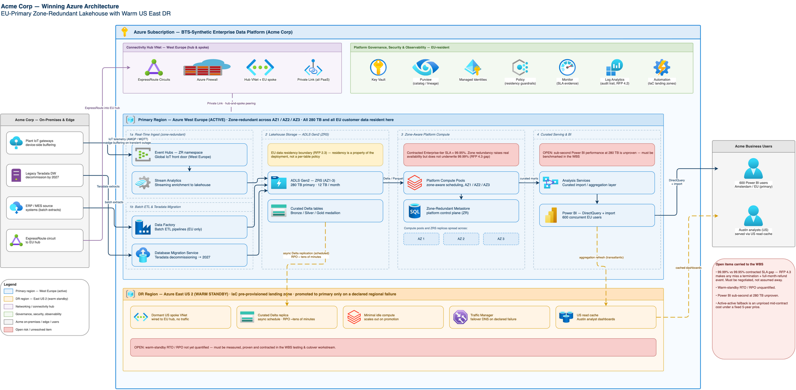

# BTS-Synthetic — Response to Acme Corp Enterprise Data Platform RFP

**Prepared for:** Sarah Chen, VP Procurement / Marcus Webb, Chief Data Officer, Acme Corp
**Prepared by:** BTS-Synthetic
**In response to:** RFP issued 2026-05-12

---

## Executive Summary

- **Proven fit, not a bet:** BTS-Synthetic's Enterprise Data Platform meets Acme's full functional scope today — real-time IoT ingest at 40,000-device/80K-events-per-second scale, batch ETL from 30+ sources, native Power BI for your 600 analysts and executives, and self-service workspaces for 150 data engineers — on an open lakehouse architecture (Delta/Iceberg/Parquet) with no vendor lock-in.
- **An architecture built for your constraints, not a generic template:** we propose an EU-Primary, Zone-Redundant Lakehouse with a Warm US East DR standby — a topology purpose-built to satisfy EU data residency in its simplest, most auditable form, hit your 280TB/12TB-month scale at sustainable cost, and keep the Teradata 2027 decommission on schedule.
- **Commercial terms designed for a 5-year partnership:** a multi-year discount structure anchored on total cost of ownership, not a headline-discount race — the way we've won and held against Databricks, Snowflake, and Fabric in comparable industrial-IoT engagements.

---

## Our Understanding of Your Need

Acme is replacing a patchwork of on-premises Teradata warehouses and ad-hoc cloud analytics with a single enterprise data platform, ahead of the 2027 Teradata decommission deadline. The platform must simultaneously serve four distinct workloads — real-time IoT telemetry from your industrial sensor base, batch integration across 30+ internal systems, BI/reporting for 600 analysts and executives who depend on Power BI today, and self-service data preparation for 150 engineers — at a current scale of ~280TB (growing ~12TB/month) with peak ingest of 80,000 events/second. As a Microsoft/Azure shop with EU and US operations, you need EU data residency handled natively, a multi-region posture spanning EU and US East, and open file formats that protect you from being locked into any single vendor's runtime. Commercially, you're seeking 5-year price certainty, aggressive discounting, and contract terms that shift risk and audit burden onto the vendor. We recognize the Power BI requirement as non-negotiable and have designed our response around it.

---

## Why We're the Right Fit

**Technical fit is strong across the board.** Our lakehouse architecture natively supports Delta, Iceberg, and Parquet — matching your open-format and portability requirement exactly. Our Power BI integration is our most mature BI adapter, purpose-built for the DirectQuery pattern your 600-user base relies on. We deploy natively on Azure with EU data residency delivered as a structural property of our recommended deployment — the simplest, most auditable posture available, and detailed further below. Our connector library covers 80+ source systems — well beyond your 30+ integration requirement — and our streaming pipeline is tested to 250,000 events/second, comfortably above your 80,000/second peak. Self-service workspaces support both citizen-analyst and professional-engineer personas out of the box. The one area requiring focused engineering attention — sustaining interactive Power BI performance at your full 280TB scale, and a small SLA gap discussed below — is addressed directly in our implementation plan, not glossed over.

**Competitively, we win on proven scale, maturity, and total cost of ownership.** We expect Databricks, Snowflake, and Microsoft Fabric to also be shortlisted. We bring a track record of running real-time industrial IoT ingest at your volume in production today, with genuine multi-region deployment and an open lakehouse architecture that keeps your data portable rather than locked to a single vendor's runtime. On economics, our fixed multi-year pricing is engineered to hold over the full term: Databricks' consumption-based compute pricing is the single biggest driver of TCO surprises in fixed-budget, multi-year deals like this one — a direct conflict with your requirement for 5-year price certainty — and Snowflake's per-query pricing model carries the same risk, with real-time/streaming capability that is a bolt-on relative to your 80,000-events/second requirement. Our angle across all three: proven scale and maturity, genuine multi-region open architecture, and predictable economics that don't erode over a 5-year term.

---

## Our Recommended Architecture

**EU-Primary Zone-Redundant Lakehouse with Warm US East DR**

We propose a single active production region — Azure West Europe — deployed zone-redundant across all three availability zones: storage, compute, ingest, and metadata catalog are all zone-aware, giving you resilience against zone-level failure without the cost and complexity of running two live production regions. All primary data (280TB) and all EU customer data live exclusively in West Europe, which makes EU data residency a structural property of the deployment — the simplest, most auditable posture available, and a direct strength when responding to your audit rights under the contract.

East US 2 operates as a warm standby: fully pre-provisioned infrastructure, curated data replicated on a scheduled cadence, minimal idle compute, and a defined promotion path to primary in the event of a declared regional failure. This gives Austin-based analysts a dedicated read-cache layer to mask cross-region latency on high-traffic Power BI dashboards, while keeping the cost base aligned to your budget requirements. IoT ingest for all 40,000 devices terminates on a single, zone-redundant Event Hubs front door in West Europe, sized for your 80,000-events/second peak with edge-side buffering to absorb transient connectivity gaps. Batch ETL, the Teradata migration pipelines, and all data-engineering workspaces run in the same primary region. Networking is a single hub-and-spoke topology with private connectivity (ExpressRoute, Private Link) into the EU hub, with the US spoke pre-wired and dormant until needed.

This topology was chosen because it delivers your required scale and residency posture at a defensible cost basis and the fastest, lowest-risk path to production — directly supporting your Teradata 2027 timeline and your stated evaluation weighting on implementation risk.

---

## Implementation Plan and Key Milestones

We structure delivery across four coordinated workstreams, sequenced so that each unblocks the next without idle time on the critical path:

**1. Infrastructure & Landing Zone (foundation — gates all other work).** Stand up the governed Azure landing zone: subscription and identity foundation, the EU hub network, zone-redundant storage/compute/metastore in West Europe, the pre-wired US East 2 DR spoke, the Event Hubs ingest front door sized to peak load, Power BI connectivity and US read-cache infrastructure, and audit/governance tooling to support your compliance requirements. This workstream also runs a dedicated resilience-engineering spike to quantify recovery objectives for the DR standby.

**2. Data & Integration.** Full discovery and migration-wave planning across Teradata and all 30+ internal sources; bulk historical migration of the ~280TB estate into open Delta/Parquet format with full reconciliation; batch ETL integration across all source systems; real-time IoT stream integration for the full device fleet; EU residency classification and enforcement tooling; the async replication pipeline feeding the US DR standby and Austin read-cache; and open-format schema governance to protect your portability requirement.

**3. Application Build.** The IoT device-ingest API and telemetry pipeline; operational tooling for batch-ETL monitoring; self-service workspaces for your 150 data engineers; the Power BI semantic layer and reporting experience for your 600 users; a residency-aware data-access layer enforcing EU boundaries at query time; DR-mode application behavior and failover hooks; and the application-layer cutover support for Teradata decommissioning.

**4. Testing & Cutover.** End-to-end integration testing across ingest, ETL, and residency enforcement; dedicated Power BI performance validation at full data scale with representative 600-user concurrency; a full DR failover and resilience drill; parallel-run validation against the legacy Teradata environment culminating in a formal go/no-go decision; a rehearsed rollback plan; and phased go-live with a hypercare monitoring window.

We will confirm a detailed milestone calendar against your target award date (2026-06-30) and the Teradata 2027 decommission deadline during contract finalization, with the source-system discovery phase (Workstream 2) beginning immediately upon signature to firm up integration scope as early as possible.

---

## Commercial Proposal

We propose Enterprise-tier pricing reflecting Acme's scale (280TB, 40,000 IoT devices, 750 named users), structured for the 3-year initial term plus 2-year renewal option you've requested. On discount, we are prepared to commit up to 30% off published list pricing — our strategic-tier ceiling, reserved for multi-year commitments of this scale, and contingent on the 3+2-year term and a mutually agreed reference arrangement. We are not able to reach your requested 35% as a standalone number: our approach is to pair this maximum available discount with a total-cost-of-ownership case that we're confident beats any headline discount our lakehouse and cloud-warehouse competitors can offer once their compute-consumption and per-query pricing is run out over your full 5-year volume. We want to work through the itemized economics with your procurement team directly so you can compare like-for-like, rather than compare headline percentages alone.

We will fix pricing for the initial contract term with renewal-year pricing confirmed at signature, giving you budget certainty across the 5-year horizon while preserving the flexibility to reflect market conditions at renewal. We propose annual invoicing in advance with a 60-day payment term, consistent with standard enterprise terms and aligned to precedent in comparable industrial-IoT engagements we've closed at this scale. We will size the committed capacity to your current footprint with an agreed buffer for organic growth, with a true-up mechanism at renewal rather than mid-term repricing, so unexpected growth in ingest volume doesn't trigger disruptive contract events. We commit to a 30-day acceptance testing window on go-live, and pro-rated refund treatment in the event of an early, mutually agreed contract exit.

On most-favoured-nation pricing: we're not able to offer a warranty that Acme's pricing will match or beat every other customer's terms for the life of the contract. Customer pricing reflects volume, term, and deal-specific factors that vary case by case, and a standing MFN warranty isn't part of our standard commercial framework. We'd rather earn your confidence on pricing through the transparent, itemized TCO case above than through a contractual promise we can't operationally stand behind.

Full five-year pricing transparency, itemized by year and by component, will be provided as a supporting schedule alongside this response, consistent with your RFP's requirement for full pricing disclosure.

---

## Contract Approach

We've reviewed your proposed terms against our standard enterprise contract framework and want to be direct about where we align and where we propose an alternative that we believe better serves both parties over a 5-year relationship:

- **Data protection and liability.** We propose a liability structure capped at a multiple of contract fees paid, with carve-outs preserved for gross negligence and IP infringement, and full coverage for notification costs and regulatory obligations within that structure. This keeps our indemnification meaningful and insurable, which protects continuity of service for you.
- **Audits and compliance.** We propose one audit per year at our cost, with 30 days' advance notice and confidentiality protections. Beyond that, we'll accommodate up to two additional audits per year at Acme's cost. This preserves your full visibility into our controls while keeping audit logistics operationally workable for both sides.
- **Service levels.** We propose a 99.95% uptime commitment — our standard Enterprise-tier SLA — with a path to a higher-availability tier as an add-on if your operational requirements call for it. Our standard remedy for any shortfall is service credits, capped at 30% of monthly fees, as the sole and exclusive remedy; we do not carry a right to immediate termination on a single SLA miss of any duration, which we believe is disproportionate to the operational impact of most service events. We propose termination rights be reserved for repeated or chronic failures, and we want to work with your team directly on the right SLA structure for your specific availability needs.
- **Intellectual property.** Acme retains full ownership of its data at all times. Custom configurations and integrations built specifically for your environment are licensed to Acme for your internal use, while the underlying platform technology remains BTS-Synthetic's — the standard structure that lets us keep improving the platform for all our customers, including you.
- **Subprocessors.** We propose a published subprocessor list with advance notice of any change and a clear objection-and-remedy path, so you retain full visibility and control without a per-vendor approval bottleneck that could slow delivery.
- **Termination.** We support termination for convenience with a notice period aligned to a smooth, orderly transition, with no early termination penalties — protecting both your flexibility and continuity of service during any transition period.

We're confident these positions are workable within a standard enterprise contract and look forward to finalizing specific language directly with your legal team.

---

## Risks and How We Mitigate Them

**Service-level expectations at your operational scale.** Delivering sub-second, interactive Power BI performance across your full 280TB estate — not just a working subset — requires deliberate performance engineering, not just default configuration. We address this directly with a dedicated performance-validation phase using representative 600-user concurrency testing before go-live, and we've engineered a dedicated US-side read-cache specifically to protect performance for your Austin-based analyst community.

**Data migration scope from 30+ source systems.** Not every legacy source is fully documented at RFP stage. We front-load a dedicated discovery and profiling phase immediately after signature, so integration scope and effort are firmed up early — well ahead of your Teradata 2027 deadline — rather than being discovered mid-build.

**Disaster-recovery readiness.** Our warm-standby DR design in US East 2 is deliberately pre-provisioned and wired from day one so that failover is a rehearsed, tested procedure rather than a first-time event. Our implementation plan includes a dedicated recovery-objective engineering phase and a full rehearsed failover drill as part of testing and cutover — not left to chance at go-live.

**Regulatory and residency assurance.** Because EU data resides exclusively in a single, dedicated EU region under our proposed architecture, demonstrating compliance to your auditors is structurally simpler than a multi-region or hybrid alternative — one region, one story, backed by a dedicated compliance test suite ahead of go-live.

We welcome the opportunity to walk your team through any of the above in more detail and to begin discovery immediately upon award.
