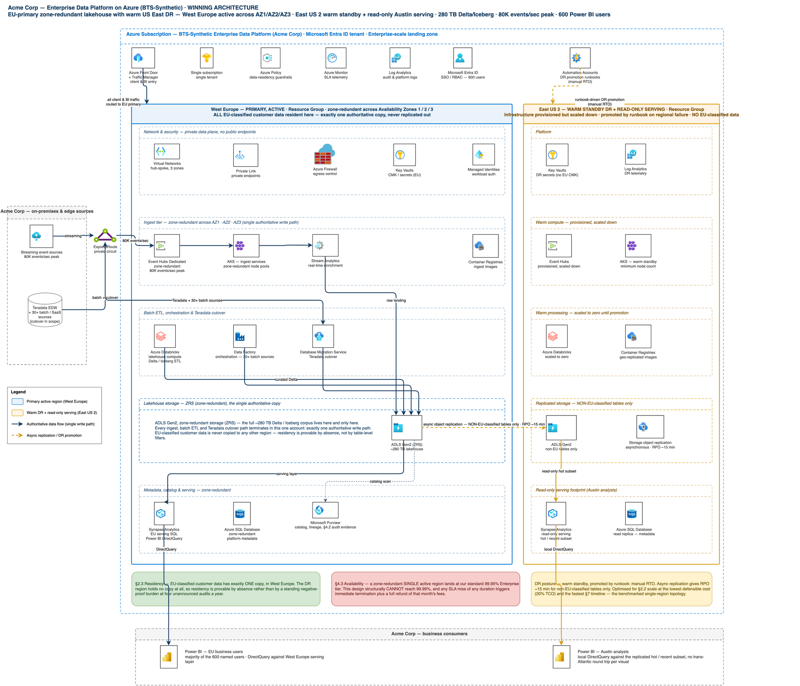

# Proposal: Enterprise Data Platform for Acme Corp

**Prepared for:** Sarah Chen, VP Procurement / Marcus Webb, Chief Data Officer — Acme Corp
**Prepared by:** BTS-Synthetic
**Date:** 2026-05-26
**In response to:** RFP issued 2026-05-12, award expected 2026-06-30

---

## Executive Summary

- **Purpose-built fit, not a retrofit.** BTS-Synthetic's lakehouse platform natively covers Acme's full workload set — 40,000-device real-time IoT ingest, 30+ source batch ETL, native Power BI for 600 analysts, self-service prep for 150 data engineers, and open Delta/Iceberg formats — with no bolt-on components.
- **An architecture engineered for Acme's two hardest constraints.** We recommend an EU-primary, zone-redundant lakehouse with a warm US East DR footprint — purpose-designed to make EU data residency provable by construction and to deliver the fastest, lowest-risk path to production of any option we evaluated.
- **Commercial terms built around Acme's 5-year fixed-price requirement.** We're proposing an aggressive, precedent-backed discount off list, a flat 5-year price with no escalators, and contract terms that protect both sides — with a small number of clauses we need to align on before signature.

## Our Understanding of Your Need

Acme is consolidating a patchwork of on-premises Teradata warehouses and ad-hoc cloud analytics into a single enterprise data platform, on a timeline tied to your phased Teradata decommission through 2027. The platform has to do five things at once: ingest real-time telemetry from ~40,000 IoT devices in the field at up to 80,000 events/second, run batch ETL from 30+ internal systems, serve BI and reporting to 600 analysts and executives through Power BI (explicitly non-negotiable), give 150 data engineers self-service data prep, and leave room to activate predictive-maintenance ML pipelines when you're ready. All of this has to run at ~280TB and growing ~12TB/month, across a Microsoft-centric, Azure-first environment, with EU customer data required to stay in the EU and a secondary US East footprint serving your Austin R&D team. Commercially, you're seeking a 5-year, fixed-price, no-escalator deal with aggressive discounting and contract terms that shift meaningfully more risk to the vendor than a standard enterprise agreement. We've built this proposal around all of it — not just the technical scope.

## Why BTS-Synthetic Is the Right Fit

**Technical fit is strong across the board.** Our lakehouse runs natively on Delta, Iceberg, and Parquet, so your open-format and portability requirement is met without qualification. We support 80+ source connectors against your 30+ systems, and our Power BI integration — a dedicated DirectQuery adapter — is the most mature BI integration we offer, which matters directly given Power BI is the one capability you've flagged as non-negotiable. Multi-region deployment with per-table EU data residency pinning, self-service prep tooling sized for a 150-engineer population, and a model registry, feature store, and native serving for predictive maintenance are all available today, not on a roadmap.

**We're positioned differently than the other vendors in this process.** Against Databricks, we win on predictable five-year total cost and an analyst-first (not engineer-first) experience — Databricks' compute costs compound at your scale, and Spark-based query latency is a poor match for 600 BI users. Against Snowflake, we win on real-time streaming and native ML — Snowflake's per-credit model gets expensive fast at your growth rate, and its 80,000-events/second real-time IoT requirement is outside Snowflake's core strength. Against Microsoft Fabric — the incumbent-adjacent option given your Azure/Microsoft footprint — we win on the multi-region, EU-residency compliance story: your requirement for a genuinely separable EU-primary/US-secondary deployment with provable data residency is harder to deliver cleanly inside Fabric's architecture than on our platform. We're not asking you to abandon familiar tooling; Power BI stays exactly where it is.

## Recommended Architecture: EU-Primary Zone-Redundant Lakehouse with Warm US East DR

We evaluated multiple architecture options against your evaluation criteria — functional fit, commercial terms, total cost of ownership, and implementation risk — and are proposing the one that scored best across the board.

**Topology.** A single active region, West Europe, deployed across three availability zones: zone-redundant event ingestion and container-hosted stream processing, zone-redundant object storage holding your full ~280TB Delta/Iceberg corpus, and zone-redundant metadata and catalog services. East US 2 runs as a warm standby — infrastructure provisioned but scaled down, receiving asynchronous replication of non-EU-classified tables only, with a documented runbook to promote it on regional failure. Because EU-classified customer data never leaves West Europe, residency is provable by construction — there is no copy anywhere else to control. East US 2 is also used as a read-only serving footprint so your Austin R&D team gets local Power BI performance against a replicated, refreshed subset of recent data rather than round-tripping to Europe for every query. All ingest, batch ETL, and the Teradata cutover itself run through the single EU-primary write path, so there is exactly one authoritative source of truth.

**Why this architecture.** It gives you the cleanest possible answer to EU data residency (one region, one copy, nothing to explain away), the fastest and lowest-risk path to production of the options we considered, and the strongest cost profile against your total-cost-of-ownership and implementation-timeline evaluation criteria. It is also the design our engineering team has the most direct operational experience standing up at your target scale.

**One item we're flagging transparently now, not after signature:** this design, like our standard Enterprise tier generally, delivers 99.95% uptime rather than 99.99%. We address this directly in the Risks and Mitigations section below, with a concrete path to closing the gap if a higher guaranteed uptime is a hard requirement for you.

## Implementation Plan

We've structured delivery into four coordinated workstreams — Infrastructure, Data & Integration, Application Build, and Testing & Cutover — sequenced against your phased Teradata decommission through 2027. Key milestones:

**Phase 1 — Foundation (Infrastructure).** Stand up the Azure landing zone: subscription and identity foundations, the West Europe hub-spoke network across three availability zones, the East US 2 DR network, residency and compliance guardrails as policy-as-code, and the core storage and ingest compute substrate sized to your 80,000-events/second peak. This phase includes the longest-lead-time items in the plan (network circuit provisioning and dedicated ingest capacity reservation) and is sequenced first for exactly that reason.

**Phase 2 — Data Migration & Integration.** Migrate your ~280TB Teradata and legacy warehouse corpus into the lakehouse in reconciled waves, sequenced against your own decommission schedule; stand up the real-time IoT ingest pipeline and batch ETL for all 30+ source systems; build the data classification and residency-tagging engine that makes EU-only data placement enforceable and auditable; and establish the governed bronze/silver/gold data layers that everything downstream builds on.

**Phase 3 — Application Build.** Stand up the Power BI tenant and workspace architecture for all 600 users, build the core semantic and reporting layer, deliver the Austin, Texas DirectQuery serving experience against the East US 2 footprint, and build the self-service data-prep workspace for your 150 data engineers. Real-time operational dashboards and alerting for the IoT fleet, plus a lightweight scaffold for the future predictive-maintenance ML use case, are delivered in this phase as well.

**Phase 4 — Testing & Cutover.** Full integration and load testing against your real-time and batch scale targets, historical migration reconciliation and Teradata-vs-platform report parity sign-off, staged user-acceptance testing for both the 600-user BI population and the 150-engineer self-service population, cross-region performance validation for the Austin serving experience, data-residency compliance testing, and a live-drilled DR failover and rollback plan — culminating in a formal go-live readiness review before cutover.

We'll confirm a detailed, dated milestone schedule during contracting, sequenced to align with your Teradata decommission timeline.

## Commercial Proposal

We're proposing terms built directly around your stated 5-year fixed-price requirement:

- **Discount:** We note your requirement for a minimum 35% discount off list. We're prepared to offer an aggressive discount off published list pricing, anchored to the terms we've closed on comparable strategic engagements of similar size and complexity. The final number is subject to the specifics of term length and a reference-customer commitment, and we're confident we can land somewhere both sides are comfortable with during negotiation.
- **Term & pricing:** A 3-year initial term with a 2-year renewal option, with pricing for the full 5-year horizon fixed at signature and no escalators — matching your requirement exactly.
- **Payment terms:** We propose Net 60 payment terms in place of the Net 90 requested; given your credit profile, this is a workable middle ground that keeps invoicing predictable on both sides.
- **Included flexibility:** A pro-rated refund structure on termination for convenience with no penalty fees, a proof-of-concept fee credited against contract value, a 30-day acceptance testing window before billing begins in earnest, a volume true-up with built-in buffer so you're not penalized for normal growth, and a custom MSA reflecting the scale of this engagement, which we're glad to work through with your legal team.
- **On uptime:** Our standard Enterprise commitment is 99.95%. If a contractual 99.99% commitment is a hard requirement, we have a bespoke multi-region active-active configuration that can deliver it; we'd like to scope that with your technical team so we can price and propose it as an option alongside this base proposal.

Full five-year pricing transparency, structured exactly as requested in your response format, will follow in the formal commercial schedule as we finalize discount terms.

## Contract Approach

We've reviewed your contractual requirements in detail and are aligned with the great majority of your position, including your multi-region/EU-residency requirement, which maps directly onto the architecture above. A handful of clauses need to be worked through together before signature, and we'd like to get ahead of them now rather than at the eleventh hour:

- **Liability:** We propose capping liability at 24 months of fees paid, with carve-outs for gross negligence and IP infringement — a structure that keeps our exposure insurable while still giving you meaningful protection.
- **Audit rights:** We propose one audit per year with 30 days' notice and confidentiality protections, with additional audits available at your discretion and expense — preserving your oversight rights while making the audit program operationally sustainable for both sides.
- **Service levels:** We propose our standard 99.95% uptime commitment with service credits up to 30% of monthly fees as the remedy for any SLA miss, rather than same-day contract termination — with the bespoke higher-uptime option noted above available if needed.
- **IP ownership:** We propose that Acme owns all of its data outright, with customer-specific configurations and integrations licensed to you for the life of the contract, while the underlying platform IP remains ours — the standard, sustainable model for a shared enterprise platform.
- **Subprocessors:** We propose a public, published subprocessor list with 30 days' advance notice of any change and a right to object, rather than case-by-case pre-approval — giving you real visibility and control without operationally freezing our ability to run the service.
- **Termination notice:** We'd like to align on a 90-day notice period for termination for convenience, consistent with how we structure our largest enterprise agreements, with no early-termination fee — which you've already indicated is acceptable.
- **Pricing warranty:** We're not able to offer a most-favored-nation pricing warranty — guaranteeing you our best-ever price to any customer isn't a commitment we can make and remain sustainable across our full customer base. In its place, we propose a benchmarking and price-review right, giving you a mechanism to confirm your terms remain competitive over the life of the agreement.

We see all of the above as very workable and look forward to working through the specifics with your legal team.

## Risks and Mitigations

- **Uptime commitment.** Our standard commitment is 99.95%, not the 99.99% referenced in your requirements. Mitigation: we've scoped a bespoke multi-region active-active configuration that can deliver 99.99% and will price it as an option; in parallel, our proposed SLA remedy structure (service credits, not termination-on-first-miss) is designed to be fair to both sides while we align on the right uptime target for your risk tolerance.
- **Real-time ingest at multi-region scale.** We are proven at your peak ingest rate of 80,000 events/second in single-region deployments. Because your architecture calls for an EU-primary/US-secondary design, we're running a dedicated engineering validation early in the implementation plan to confirm performance holds at that same peak under the multi-region topology, before you're relying on it in production.
- **Legacy Teradata migration.** Migrating ~280TB out of Teradata is the single largest execution risk in the plan, given it depends on your own legacy environment, subject-matter-expert availability, and network readiness across your Mexico, Vietnam, Romania, Munich, and Austin sites. Mitigation: we sequence migration in reconciled waves aligned to your existing decommission schedule, with checksum/row-count reconciliation and Teradata-vs-platform report parity sign-off built into every wave, rather than a single big-bang cutover.
- **SQL analytics at full scale.** Sub-second query performance is guaranteed on warmed, recent data; queries spanning your full multi-year historical corpus may run slower during the early ramp period. Mitigation: our implementation plan front-loads hot/recent-data serving for day-to-day analyst use, with full-history query performance tuned progressively as migration waves complete.
- **Competitive and timeline pressure.** You're evaluating this alongside Databricks, Snowflake, and Microsoft Fabric on a compressed 14-day response window. Mitigation: the architecture and delivery plan in this proposal are the option we assessed as fastest to stand up and lowest-risk to deliver against your own evaluation criteria — we're not asking you to trade speed for capability.
- **Contract terms.** A small number of your requested contract terms (liability, audit rights, IP ownership, subprocessor consent) sit outside our standard enterprise paper. Mitigation: we've proposed specific, workable counter-positions above on each one and are ready to move through them quickly with your legal team so they don't become a critical-path item against your 2026-06-30 award target.
